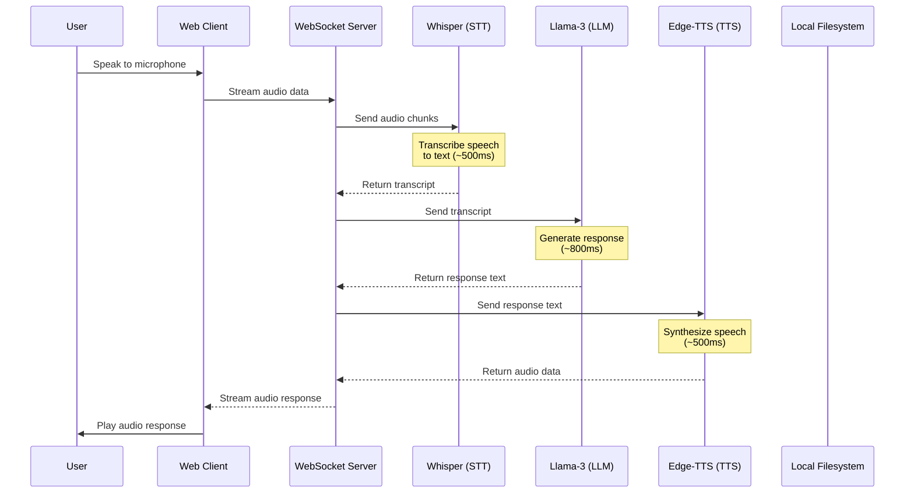

# Echo Voice Support

**Real-time AI voice support chatbot with zero API costs. Fully local, privacy-first.**

  

## Overview

Echo Voice Support is a real-time voice AI assistant that processes speech locally using:
- **Whisper** for speech-to-text
- **Llama-3** (via Ollama) for AI responses
- **Edge-TTS** for natural-sounding speech synthesis

All processing happens on your machine - no data leaves your infrastructure.

## Architecture



## Features

- **100% Local Processing** - No cloud dependencies, complete privacy
- **Sub-2 Second Latency** - Optimized pipeline for real-time conversation
- **Indian Accent TTS** - Natural-sounding voices with en-IN-NeerjaNeural
- **WebSocket Communication** - Real-time bidirectional streaming
- **Session Management** - Conversation context across messages
- **Low Resource Usage** - Runs on CPU, optimized for efficiency

## Tech Stack

| Component | Technology | Purpose |
|-----------|------------|---------|
| STT | Faster Whisper | Local speech recognition |
| LLM | Llama-3 (Ollama) | Conversational AI |
| TTS | Microsoft Edge-TTS | Neural voice synthesis |
| Server | Python asyncio | WebSocket server |
| Client | Vanilla JS + WebRTC | Browser interface |

## Prerequisites

- Python 3.10+
- Ollama installed with Llama-3 model
- 4GB+ RAM recommended
- Microphone access

## Installation

### 1. Clone the Repository

```bash
git clone https://github.com/Fronter-xd/echo-voice-support.git
cd echo-voice-support
```

### 2. Set Up Python Environment

```bash
python -m venv venv
source venv/bin/activate  # On Windows: venv\Scripts\activate
pip install -r requirements.txt
```

### 3. Install Ollama

```bash
# Install Ollama (macOS/Linux)
curl -fsSL https://ollama.com/install.sh | sh

# Pull Llama-3 model
ollama pull llama3

# Start Ollama server
ollama serve
```

### 4. Download Whisper Model

```bash
# The first run will auto-download the model
# Or manually:
# Model options: tiny, base, small, medium, large
```

## Usage

### Start the Server

```bash
python server.py
```

The server will start on `ws://localhost:8765`

### Open the Web Client

Open `web/index.html` in your browser, or serve it:

```bash
cd web && python -m http.server 8080
```

Then visit `http://localhost:8080`

### CLI Mode (Text Input)

```bash
python -c "
import asyncio
from voice_engine import VoiceEngine

async def main():
    engine = await engine.start()
    
    while True:
        text = input('You: ')
        if text.lower() == 'exit':
            break
        
        result = await engine.process_text_input(text, 'cli_user')
        print(f'Echo: {result.text_output}')
        print(f'Timing: {result.timing.total_time_ms:.0f}ms')
    
    await engine.stop()

asyncio.run(main())
"
```

## Configuration

Edit `config/settings.env`:

```env
# STT Settings
WHISPER_MODEL=base
WHISPER_DEVICE=cpu

# LLM Settings
OLLAMA_BASE_URL=http://localhost:11434
OLLAMA_MODEL=llama3

# TTS Settings (Indian Accent)
TTS_VOICE=en-IN-NeerjaNeural

# Performance
VAD_ENABLED=true
```

### Available TTS Voices

| Voice | Description |
|-------|-------------|
| `en-IN-NeerjaNeural` | Indian female (default) |
| `en-IN-PrabhatNeural` | Indian male |
| `hi-IN-MadhurNeural` | Hindi female |
| `ta-IN-PallaviNeural` | Tamil female |

## Project Structure

```
echo-voice-support/
├── voice_engine.py          # Main orchestrator
├── server.py                # WebSocket server
├── services/
│   ├── stt.py              # Speech-to-Text (Whisper)
│   ├── llm.py              # Language Model (Ollama)
│   └── tts.py              # Text-to-Speech (Edge-TTS)
├── config/
│   └── settings.py         # Configuration
├── web/
│   └── index.html          # Web client
├── config/
│   └── settings.env        # Environment config
└── requirements.txt
```

## Performance

Typical latency breakdown for a complete round-trip:

| Stage | Expected Time |
|-------|--------------|
| STT (Whisper) | 300-600ms |
| LLM (Llama-3) | 500-1000ms |
| TTS (Edge-TTS) | 200-500ms |
| **Total** | **~1-2 seconds** |

## API Reference

### WebSocket Messages

#### Client → Server

**Audio Message:**
```json
{
  "type": "audio",
  "data": "<base64_encoded_audio>"
}
```

**Text Message:**
```json
{
  "type": "text",
  "text": "Hello, how are you?"
}
```

#### Server → Client

**Response:**
```json
{
  "type": "response_audio",
  "data": "<base64_encoded_audio>",
  "transcript": "Hello",
  "response": "I'm doing well, thank you!",
  "timing": {
    "stt_ms": 450,
    "llm_ms": 780,
    "tts_ms": 320,
    "total_ms": 1550
  }
}
```

## Troubleshooting

### Common Issues

**"Connection refused" error:**
- Ensure the server is running: `python server.py`
- Check WebSocket URL in client matches server

**"Microphone access denied":**
- Grant microphone permissions in browser
- Check browser settings

**"Ollama not responding":**
- Start Ollama: `ollama serve`
- Pull the model: `ollama pull llama3`

**High latency:**
- Use smaller Whisper model (tiny/base)
- Close other resource-heavy applications
- Consider using SSD for model storage

## Development

### Run Tests

```bash
pytest tests/
```

### Code Style

```bash
ruff check .
ruff format .
```

## Contributing

1. Fork the repository
2. Create a feature branch
3. Make your changes
4. Submit a pull request

## License

MIT License - see [LICENSE](LICENSE) for details.

## Disclaimer

This project is for educational and legitimate voice assistant purposes. Ensure compliance with applicable laws and platform terms of service when using voice recording and processing features.
